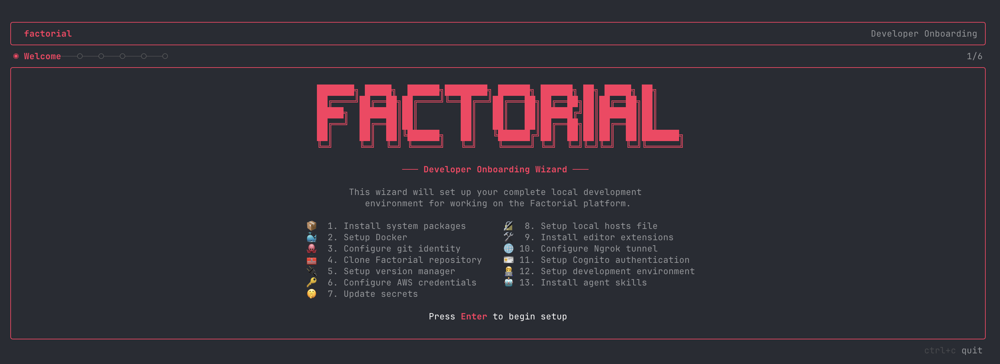

# @factorialco/welcome

Interactive terminal wizard for setting up your local Factorial development environment.



Replaces the legacy `welcome.sh` shell script with a polished TUI built with [Ink](https://github.com/vadimdemedes/ink) (React for the terminal). It guides new developers through 13 setup tasks across 6 screens, running tasks in parallel where dependencies allow.

## Usage

```bash
npx github:factorialco/welcome#v1
```

Or clone and run locally:

```bash
git clone git@github.com:factorialco/welcome.git
cd welcome
npm install
npm start
```

## Screens

| Screen       | Purpose                                                  |
| ------------ | -------------------------------------------------------- |
| **Welcome**  | Overview of all 13 tasks                                 |
| **Identity** | Git name, email, SSH key setup                           |
| **Tools**    | Version manager (mise/asdf) and editor (Cursor/VS Code)  |
| **Services** | Ngrok tunnel, Cognito authentication, DB restore options |
| **Review**   | Summary of chosen configuration before install           |
| **Install**  | Parallel task execution with live progress               |

## What it installs

1. **System packages** -- Homebrew, Brewfile (30+ formulae and casks), direnv
2. **Docker** -- Colima, architecture-aware config (vz/virtiofs on Apple Silicon)
3. **Git identity** -- SSH key generation, GitHub SSO authorization
4. **Clone repository** -- `factorialco/factorial` to `~/code/factorial`, git perf settings
5. **Version manager** -- mise or asdf with Ruby, Node.js, Python, Rust plugins
6. **AWS credentials** -- SSO login with `development` profile
7. **Secrets** -- Retrieve env vars from AWS Secrets Manager
8. **Hosts file** -- 27 `*.local.factorial.dev` entries in `/etc/hosts`
9. **Editor extensions** -- 23+ VS Code/Cursor extensions + custom `.vsix` packages
10. **Ngrok tunnel** -- Domain and authtoken configuration
11. **Cognito** -- KMS, IAM Role, Lambda, User Pool, Client, domain provisioning
12. **Dev environment** -- pnpm/yarn install, bundle install, docker-compose, DB setup
13. **Agent skills** -- 5 skill repos for AI coding assistants

Tasks run in parallel tiers based on their dependency graph -- independent tasks start as soon as their prerequisites finish.

## Requirements

- macOS
- Node.js >= 18
