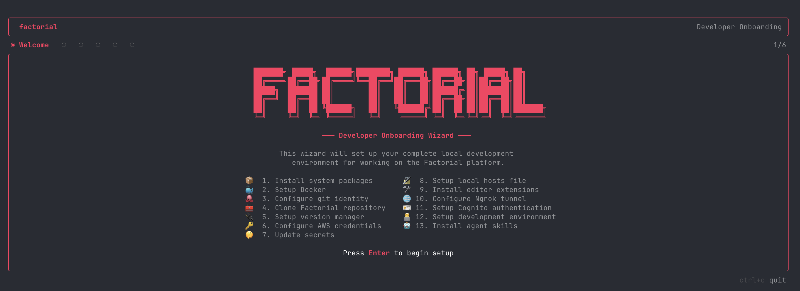

# @factorialco/welcome

Interactive terminal wizard for setting up your local Factorial development environment.



Replaces the legacy `welcome.sh` shell script with a polished TUI built with [Ink](https://github.com/vadimdemedes/ink) (React for the terminal). It guides new developers through 13 setup tasks across 6 screens, running tasks in parallel where dependencies allow.

## Usage

On a new machine. This installs Homebrew and Node.js first, then starts the wizard:

```bash
/bin/bash -c "$(curl -fsSL https://raw.githubusercontent.com/factorialco/welcome/v1/install.sh)"
```

Use the `$( )` form above, not `curl ... | bash`. The wizard is an interactive terminal UI. A pipe leaves the script's stdin attached to curl instead of your terminal, so the UI cannot read your keystrokes.

If you already have Node.js >= 24 and git:

```bash
npx --yes github:factorialco/welcome#v1
```

Or clone and run locally:

```bash
git clone git@github.com:factorialco/welcome.git
cd welcome
npm install
npm start
```

### Bootstrap options

Set these before the bootstrap command:

| Variable              | Effect                                              |
| --------------------- | --------------------------------------------------- |
| `WELCOME_REF`         | Branch or tag of the wizard to run. Default `v1`.   |
| `WELCOME_SKIP_LAUNCH` | Install Homebrew and Node.js, then stop.            |
| `WELCOME_DRY_RUN`     | Print the install commands instead of running them. |
| `WELCOME_DEBUG`       | Trace every command.                                |

The bootstrap appends progress to `/tmp/welcome-bootstrap.log`. The wizard itself logs to `/tmp/welcome.log`.

### Troubleshooting

**Nothing happened.** With the `$( )` form, a failed download becomes an empty script that exits 0. Curl still writes its error to stderr, but to see it clearly, download in two steps:

```bash
curl -fsSL https://raw.githubusercontent.com/factorialco/welcome/v1/install.sh -o /tmp/install.sh && /bin/bash /tmp/install.sh
```

**"No terminal on stdin".** You used a pipe, or you are on a CI runner. Use the `$( )` form.

**"This terminal runs under Rosetta".** The bootstrap refuses on purpose, because Homebrew would install its Intel build on an Apple Silicon Mac. Open a native terminal, or prefix the command with `arch -arm64`.

**Behind a proxy.** Curl honours `HTTPS_PROXY`.

## Screens

| Screen       | Purpose                                                  |
| ------------ | -------------------------------------------------------- |
| **Welcome**  | Overview of all 13 tasks                                 |
| **Identity** | Git name, email, SSH key setup                           |
| **Tools**    | Version manager (mise/asdf) and editor (Cursor/VS Code)  |
| **Services** | Ngrok tunnel, Cognito authentication, DB restore options |
| **Review**   | Summary of chosen configuration before install           |
| **Install**  | Parallel task execution with live progress               |

## What it installs

1. **System packages** -- Homebrew, Brewfile (30+ formulae and casks), direnv
2. **Docker** -- Colima, architecture-aware config (vz/virtiofs on Apple Silicon)
3. **Git identity** -- SSH key generation, GitHub SSO authorization
4. **Clone repository** -- `factorialco/factorial` to `~/code/factorial`, git perf settings
5. **Version manager** -- mise or asdf with Ruby, Node.js, Python, Rust plugins
6. **AWS credentials** -- SSO login with `development` profile
7. **Secrets** -- Retrieve env vars from AWS Secrets Manager
8. **Hosts file** -- 27 `*.local.factorial.dev` entries in `/etc/hosts`
9. **Editor extensions** -- 23+ VS Code/Cursor extensions + custom `.vsix` packages
10. **Ngrok tunnel** -- Domain and authtoken configuration
11. **Cognito** -- KMS, IAM Role, Lambda, User Pool, Client, domain provisioning
12. **Dev environment** -- pnpm/yarn install, bundle install, docker-compose, DB setup
13. **Agent skills** -- 5 skill repos for AI coding assistants

Tasks run in parallel tiers based on their dependency graph -- independent tasks start as soon as their prerequisites finish.

## Requirements

- macOS (Ventura or newer) on an Administrator account
- An internet connection

Nothing else. Curl ships with macOS, and the bootstrap installs Homebrew, git and Node.js.

## Releasing

Merge to `main`, then move the tag:

```bash
git tag -f v1 && git push -f origin v1
```

`install.sh` is served from raw.githubusercontent.com, which caches for about 5 minutes. Keep the script thin and stable, and put logic that changes often in the wizard, where the ref resolves at run time.

`package-lock.json` must stay committed. The bootstrap hands off to `npx`, which needs it.
